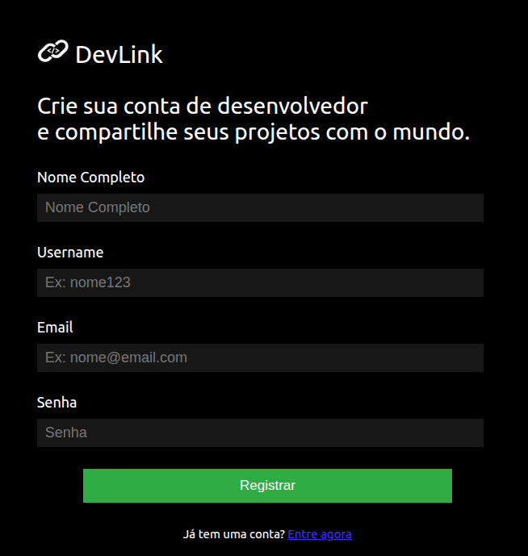

# Sistema de Cadastro e Login

Este é um projeto de autenticação de usuários, desenvolvido com o objetivo de praticar conceitos de desenvolvimento web, como criação de contas, login e gerenciamento de sessões, utilizando Spring Security, Thymeleaf e tecnologias de frontend (HTML, CSS e JavaScript).

## Funcionalidades
- Cadastro de usuário
- Login com autenticação
- Validação de dados
- Home simples com botão de logout
- Mensagens de erro
- Funcionalidade "Remember Me"
- Logout
- Responsividade do frontend

## Endpoints
| Método | Rota               | Descrição                  |
|--------|--------------------|----------------------------|
| POST   | /register  | Cadastra um usuário  |
| POST   | /login  | Realiza login  |
| GET    | /home | Após login |

> Observação: O GET /home só pode ser acessado por usuários autenticados.

## Tecnologias Utilizadas
- **Java 17**
- **Spring Boot**
- **Spring Security**
- **Thymeleaf**
- **Spring Data JPA**
- **Banco de Dados: MySQL**
- **Bean Validation**
- **Lombok**
- **Frontend: HTML, CSS e JavaScript (integrado com Thymeleaf)**

## Demonstração
**Tela de Registro:**

**Tela de Login:**

